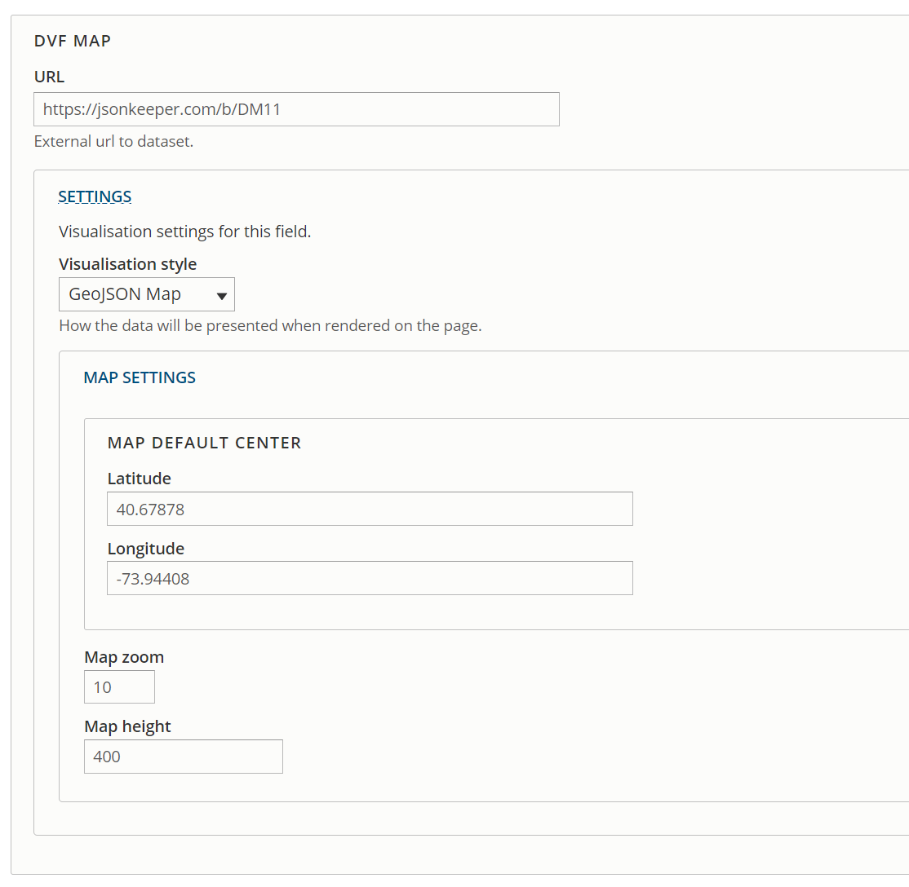
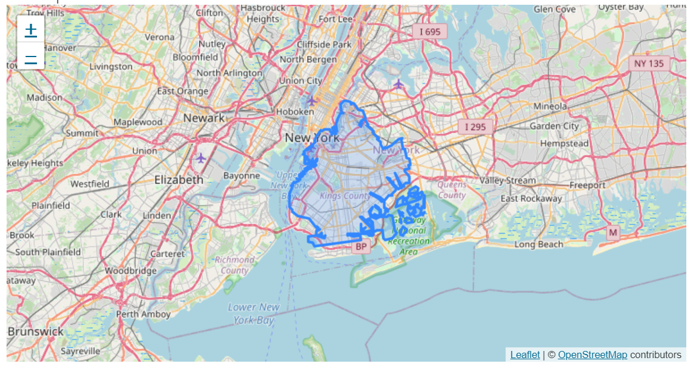

# DVF GeoJSON

This is an example Drupal module demonstrating a potential use case for
[Data Visualisation Framework (DVF)](https://www.drupal.org/project/dvf) with geospatial data, specifically GeoJSON.
It also provides an example for how a developer might implement a third party frontend library that is not
included out-of-the-box with DVF.

## This is a proof of concept

This module isn't intended for production use, it is more of a demonstration of how maps could be integrated
with DVF with a working example.

## How to use

* Install and enable this module
* Create a new DVF "Visualisation URL" field on your entity of choice
* Select "GeoJSON" as a source type
* Create a new entity and in your DVF GeoJSON field, add a url to some valid GeoJSON
  * Eg Brooklyn layer `https://jsonkeeper.com/b/DM11`
  * [A few other examples here](https://github.com/ebrelsford/geojson-examples)
* Add a center lat/lng that aligns with your GeoJSON data
* Save and view, you should see a map that looks something like [this](https://github.com/ebrelsford/geojson-examples/blob/master/brooklyn_new.geojson)

### Settings example (source)

### Output example (style)

## Author

[Jeremy Graham](https://github.com/jez500) from [Doghouse Agency](https://doghouse.agency/)

Sponsored by [govCSM](https://github.com/jez500)

